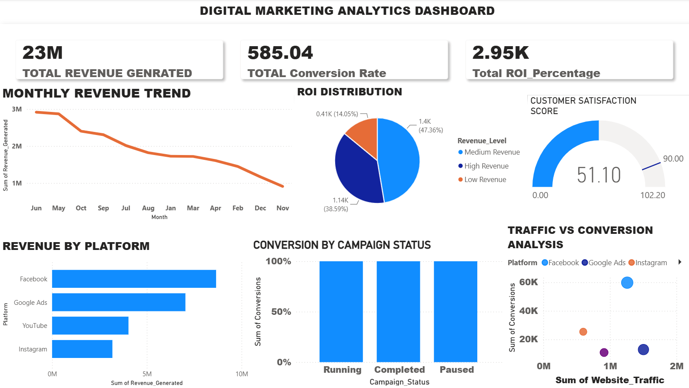

# Nestlé Sales Dashboard

## Overview

This Power BI dashboard analyzes Nestlé sales performance using interactive visualizations and KPI reporting. It provides insights into revenue, profit, product performance, regional sales, and monthly business trends.

## Tools Used

- Power BI
- Microsoft Excel
- DAX
- Power Query

## Dashboard Features

- Sales KPIs
- Profit Analysis
- Revenue Trend
- Regional Performance
- Product Category Analysis
- Top Products
- Interactive Filters and Slicers

## Key Insights

- Monitored monthly sales performance.
- Compared regional sales and profitability.
- Identified top-performing products.
- Visualized business growth using KPI dashboards.

## Dataset

This dashboard was created using a structured sales dataset for learning and portfolio purposes.
## Dashboard Preview

## Files

- nestle-dashboard.pbix
- nestle-dashboard.png
