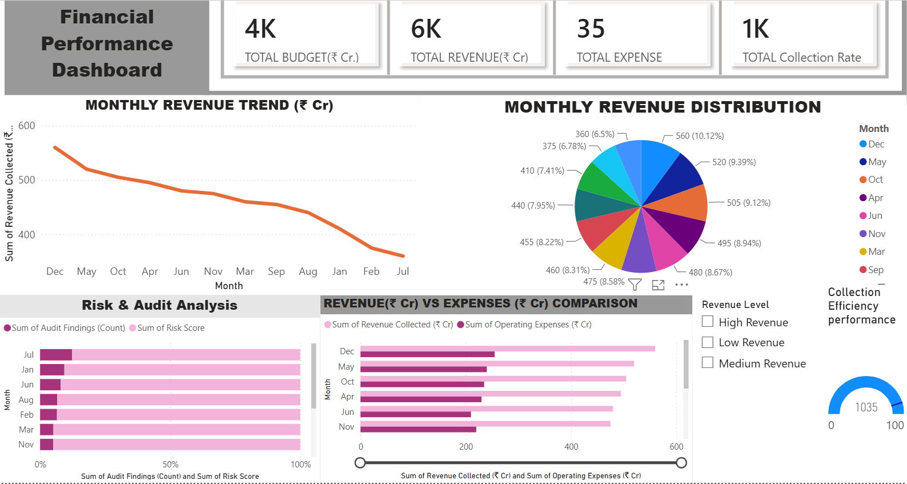

# Reliance Financial Dashboard

## Overview

This Power BI dashboard analyzes the financial performance of Reliance Telecom using KPI reporting and interactive data visualization.

## Tools Used

- Power BI
- Microsoft Excel
- DAX
- Power Query

## Dashboard Features

- Financial KPIs
- Revenue Analysis
- Expense Analysis
- Budget vs Revenue
- Collection Efficiency
- Risk Analysis
- Monthly Performance Trend

## Dashboard Preview

## Files

- reliance-dashboard.pbix
- reliance-dashboard.png
